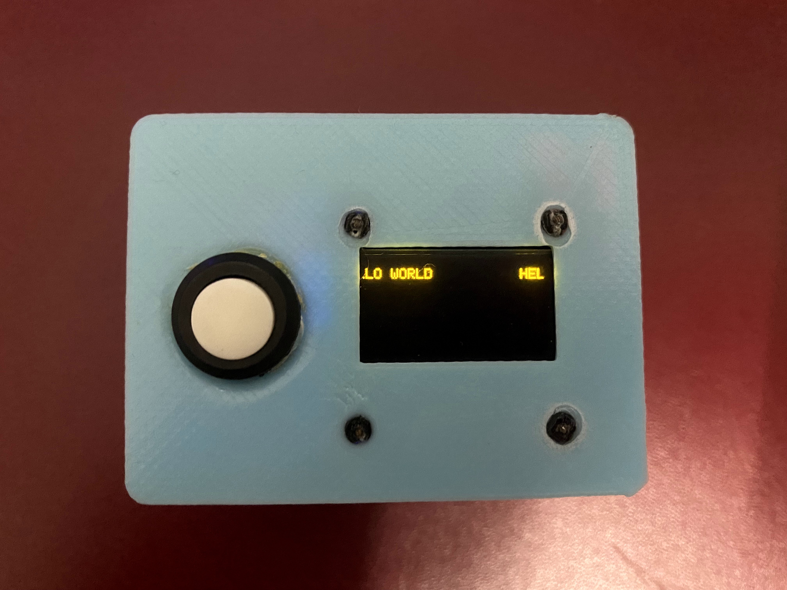
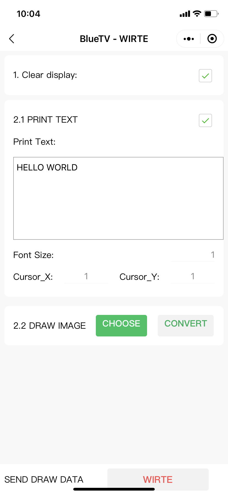

# arduino + oled + miniprogram = BlueTV

1. run miniprogram -> [install devtool](https://developers.weixin.qq.com/miniprogram/dev/framework/quickstart/getstart.html#%E5%AE%89%E8%A3%85%E5%BC%80%E5%8F%91%E5%B7%A5%E5%85%B7)
2. run arduino -> build -> upload

## Result
1. BlueTV get data by bluetooth then display oled

2. miniprogram seed some data by bluetooth
